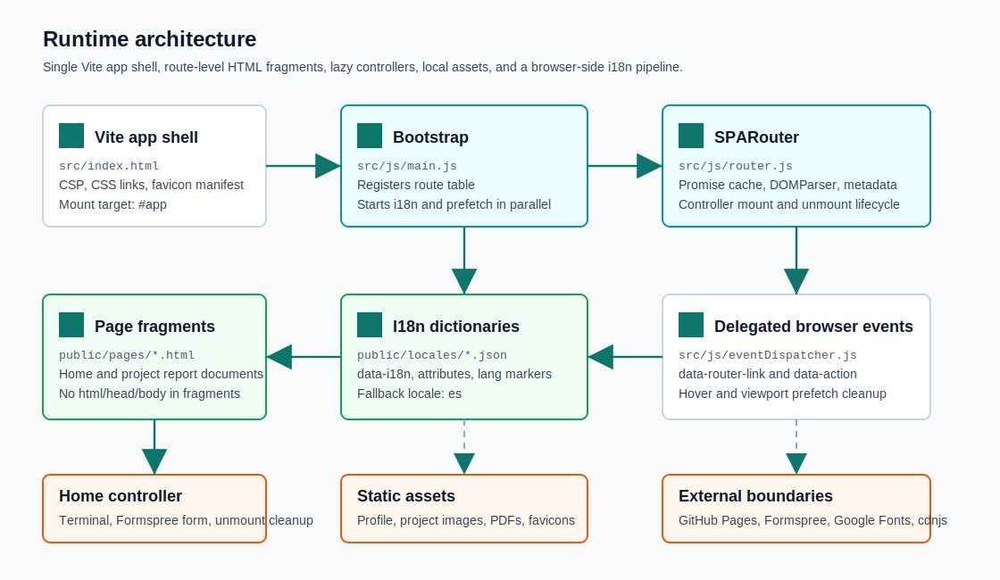

<div align="center">

  <h1>My Portfolio</h1>

  <p>
    Vanilla JavaScript portfolio SPA with route-level HTML fragments, JSDoc type checking,
    localized content dictionaries, local project media, and GitHub Pages deployment.
  </p>

  <p>
    
    
    
    
    
    
  </p>
</div>

## What This Repository Is

This repository contains the source for Alaska Elaina Gonzalez's portfolio site. It is implemented as a custom single page application rather than a React, Vue, or Svelte app: the browser loads one Vite-managed shell, then a small router fetches static HTML fragments from `public/pages/` and injects the active document into `#app`.

The project is intentionally close to the platform. Routing, i18n, theme state, delegated actions, route prefetching, terminal behavior, and contact-form handling are implemented with browser APIs and plain ES modules. Vite is used for local development, bundling, asset copying, and build output.

No nested Git repositories were found during documentation discovery. This README covers the full repository.

## Core Capabilities

| Capability | Primary implementation | Runtime responsibility |
| --- | --- | --- |
| SPA routing | `src/js/router.js`, `src/js/main.js` | Registers canonical routes, handles browser history, fetches page fragments, parses them with `DOMParser`, swaps `#app` content with `replaceChildren`, updates metadata, and mounts optional controllers. |
| Route prefetching | `src/js/router.js`, `src/js/eventDispatcher.js` | Stores in-flight and resolved fragment requests as `Promise<string>` values so hover, viewport, and active navigation can share the same fetch. |
| Controller lifecycle | `src/js/controllers/homeController.js` | Mounts route-specific behavior after the fragment is injected and returns `unmount()` so listeners, timers, and interactive state are cleaned before navigation. |
| Internationalization | `src/js/i18n.js`, `public/locales/*.json` | Detects locale, caches dictionaries, translates `data-i18n`, `data-i18n-attr`, and `data-i18n-lang`, and falls back to Spanish when a key or dictionary is unavailable. |
| Delegated UI actions | `src/js/eventDispatcher.js` | Handles `data-router-link`, `data-action`, copy buttons, mobile menu behavior, form cleanup, and IntersectionObserver cleanup from one document-level dispatcher. |
| Interactive home page | `src/js/terminal.js`, `src/js/form.js`, `public/pages/home.html` | Provides a simulated read-only shell, CV opener, command history, contact form validation, and Formspree submission. |
| Project reports | `public/pages/jobbot.html`, `public/pages/auditoria-contratacion.html`, `public/pages/invariant.html` | Renders long-form technical documents as SPA routes with local project media, PDFs, and route-specific metadata. |
| Verification pipeline | `package.json`, `.github/workflows/deploy.yml` | Defines lint, unit, JSDoc type-check, build, and Playwright scripts. The deploy workflow currently runs lint, unit tests, type checking, and build before publishing. |

## Architecture



The app boot path is deliberately small:

1. `src/index.html` loads the CSS files explicitly, defines the CSP, exposes `#app`, and imports `src/js/main.js` as the single module entry point.
2. `main.js` starts `i18n.init()` and `router.prefetch(window.location.pathname)` in parallel so the current dictionary and current HTML fragment can travel at the same time.
3. `SPARouter.registerRoutes()` maps route paths to static fragment files and optional dynamic controller imports.
4. `SPARouter.loadPage()` fetches or reuses the cached fragment promise, parses the HTML, replaces the current app children, translates the new DOM, updates navigation and metadata, then mounts the controller for that route.
5. `initDispatcher()` keeps global navigation and action handling stable across DOM replacement by listening at the document level.
6. Controllers own cleanup for behavior they attach. The home controller removes the contact form listener and calls `unmountTerminal()` when another route is loaded.

## Route Map

| Route | Fragment | Controller | Notes |
| --- | --- | --- | --- |
| `/` | `public/pages/home.html` | `src/js/controllers/homeController.js` | Main portfolio page, terminal, project links, contact form, social links, support panel, profile image, and CV link. |
| `/proyectos/jobbot` | `public/pages/jobbot.html` | None | Technical report route with localized content and local JobBot images. |
| `/proyectos/auditoria-contratacion` | `public/pages/auditoria-contratacion.html` | None | Security audit report route with redacted examples and a local PDF link. |
| `/proyectos/invariant` | `public/pages/invariant.html` | None | Technical document route for INVARIANT. The page body is embedded in Spanish; navigation and metadata use i18n keys. |

`public/404.html` supports direct navigation on GitHub Pages by redirecting unknown static paths to `/?redirect=<path>`. The router consumes that query parameter, rewrites browser history, and loads the matching SPA route.

## Repository Layout

```text
.
|-- .github/workflows/deploy.yml       # GitHub Pages build and deploy workflow
|-- docs/assets/                       # README-only SVG assets
|-- public/
|   |-- 404.html                       # GitHub Pages SPA redirect shim
|   |-- assets/                        # Profile, PDFs, favicons, and project images copied as-is
|   |-- locales/                       # es, en, and ja dictionaries
|   `-- pages/                         # Route fragments loaded into #app
|-- src/
|   |-- index.html                     # Vite HTML entry and app shell
|   |-- css/                           # Explicitly linked global, layout, component, page, terminal, and theme CSS
|   `-- js/                            # Router, i18n, dispatcher, terminal, controllers, theme, menu, carousel, forms
|-- tests/                             # Vitest unit tests for router and i18n behavior
|-- e2e/                               # Playwright route, locale, terminal, and form tests
|-- global.d.ts                        # Window globals used by plain JS modules and inline compatibility hooks
|-- vite.config.js                     # Vite root/public/dist/chunk/visualizer config
|-- vitest.config.js                   # happy-dom unit test environment
|-- playwright.config.js               # Preview-server backed Chromium E2E config
`-- tsconfig.json                      # TypeScript checkJs configuration for JavaScript files
```

## Prerequisites

| Requirement | Why it is needed |
| --- | --- |
| Node.js 22 | The GitHub Actions workflow uses Node 22, so local verification should match CI. |
| npm | Dependency installation and script runner. The repository includes `package-lock.json`. |
| A modern browser | The runtime uses ES modules, `fetch`, `DOMParser`, `IntersectionObserver`, `CustomEvent`, `localStorage`, and History API. |
| Playwright browser binaries | Needed only for `npm run test:e2e`. |

There is no `.env.example` and no runtime environment-variable loader in this repository. Configuration is handled through Vite config, static HTML, locale JSON, and public assets.

## Quick Start

Install dependencies from the repository root:

```bash
npm install
```

Start the Vite development server:

```bash
npm run dev
```

Create the production build in `dist/`:

```bash
npm run build
```

Serve the already-built `dist/` directory locally:

```bash
npm run preview
```

Run the main verification commands used by this project:

```bash
npm run lint
npm run test
npx tsc --noEmit
npm run build
```

Run the browser E2E suite against the built preview output:

```bash
npm run test:e2e
```

`npm run test:e2e` starts `npm run preview` through Playwright, so build first when you want the E2E suite to exercise the latest production output.

## Configuration Notes

| File | Important behavior |
| --- | --- |
| `vite.config.js` | Sets `root: 'src'`, maps `public/` with `publicDir: '../public'`, emits to `dist/`, splits `router.js` and `i18n.js` into a `core` manual chunk, and writes `dist/stats.html` through `rollup-plugin-visualizer`. |
| `src/index.html` | Defines CSP, metadata placeholders, external font/icon sources, the app shell, explicit CSS links, favicon links, and the single module entry. |
| `src/js/main.js` | Central route registry. Add or remove active routes here rather than modifying router internals. |
| `public/locales/*.json` | User-facing strings for Spanish, English, and Japanese dictionaries. Keep route metadata, navigation labels, alt text, and report copy synchronized when changing translated pages. |
| `global.d.ts` | Declares intentional `window.*` globals used by the vanilla modules and compatibility hooks. Update it when adding a new global handler. |
| `.eslintrc.cjs` | Blocks `innerHTML` and `outerHTML` assignments. The router uses `DOMParser` plus `replaceChildren` for fragment insertion. |

## Adding Or Changing A Route

1. Add the route object in `src/js/main.js` inside `router.registerRoutes([...])`.
2. Create the fragment at `public/pages/<name>.html`. Do not include `DOCTYPE`, `html`, `head`, or `body`.
3. Use `data-router-link` on internal anchors that should stay inside the SPA.
4. Add a controller in `src/js/controllers/` only if the route attaches listeners, starts timers, creates observers, opens canvases, or owns other behavior that needs cleanup.
5. Return `{ unmount() }` from that controller and release everything the controller created.
6. Add matching keys to `public/locales/es.json`, `public/locales/en.json`, and `public/locales/ja.json` when the fragment uses translated text or attributes.
7. Add the route prefix to `updateMetaTags()` in `src/js/router.js` so title, description, Open Graph, and Twitter metadata are correct.
8. Extend Vitest or Playwright coverage when the new route changes navigation, i18n, metadata, forms, terminal behavior, or any user-facing flow.

## Operations And Deployment

Deployment is automated through `.github/workflows/deploy.yml`.

The workflow runs on pushes to `main` and on manual dispatch. It checks out the repository, installs dependencies with npm, runs lint, unit tests, `npx tsc --noEmit`, and `npm run build`, then uploads `dist/` to GitHub Pages. The Playwright E2E script exists for local browser verification but is not currently part of the deploy workflow. The repository root includes `.nojekyll`, so GitHub Pages does not run Jekyll over the output.

The production build copies `public/` assets as-is and writes Vite output into `dist/`. Because route fragments and locale files live in `public/`, broken links usually come from a path mismatch, not from bundler import resolution.

## Security And Trust Boundaries

This is a static frontend repository, but it still has real browser trust boundaries:

| Boundary | Current behavior |
| --- | --- |
| Content Security Policy | `src/index.html` restricts default resources to `self`, allows Google Fonts and cdnjs Font Awesome for styles/fonts, allows images from `self`, `https://alaska45l.github.io`, and `data:`, and limits network `connect-src` to `self` plus Formspree. |
| Contact form | `public/pages/home.html` posts to a public Formspree endpoint. No secret is stored in the repo; the client-side form only validates required fields and handles success/error UI. |
| Fragment insertion | ESLint forbids direct `innerHTML` and `outerHTML` writes. The router parses fragments with `DOMParser` and inserts parsed nodes with `replaceChildren`. |
| External links | Project, social, PDF, and documentation links use normal browser navigation. External anchors generally use `target="_blank"` with `rel="noopener"` or `rel="noopener noreferrer"`. |
| Security report content | The audit page contains redacted examples. Do not replace those placeholders with live third-party endpoints, credentials, or exploitable payloads. |
| Static binaries | PDFs and images under `public/assets/` are shipped directly. Keep large binaries out of version control unless they are part of the public site. |

## Troubleshooting

| Symptom | Likely cause | Fix |
| --- | --- | --- |
| Internal link causes a full page reload | The anchor is missing `data-router-link`. | Add `data-router-link` to internal SPA anchors and keep external links without it. |
| A direct GitHub Pages URL falls back unexpectedly | The route is not registered or `public/404.html` redirected to a path the router does not know. | Add the route in `src/js/main.js` and verify the fragment path exists under `public/pages/`. |
| Text renders as translation keys | Locale JSON is missing the key or `data-i18n-attr` contains invalid JSON. | Add the key to every locale file and validate the attribute JSON. |
| Metadata does not change after navigation | The route is missing from `prefixMap` in `SPARouter.updateMetaTags()`. | Add the route-to-prefix mapping and corresponding `meta.<prefix>` locale keys. |
| Terminal behavior persists after navigation | A controller or module left timers/listeners alive. | Ensure the route controller returns `unmount()` and clears listeners, timers, observers, and global references. |
| E2E tests use stale content | Playwright serves `dist/` through `npm run preview`. | Run `npm run build` before `npm run test:e2e`. |
| Form submission fails locally | Formspree is blocked, unavailable, or disallowed by CSP changes. | Keep `connect-src` aligned with the configured form endpoint and use Playwright route mocking for tests. |

## License

This project is licensed under the MIT License. See [LICENSE](LICENSE).
